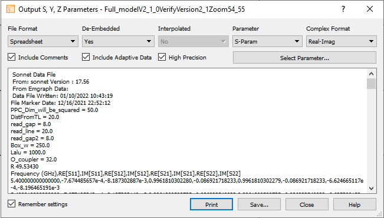

# Importing data into Lorenzian fit main.py

1. Run your *simulation* 
2. Go to *graph*
3. Go to *Ouput* menu on the top
4. Click *S,Y, Z-parameter file*
5. Fill in the the parameters like in the following image

6. **Important:** Take extra care to make sure that you export in Real-Imaginay format. 
7. Once you have exported these files. You can put them in the Lorenzian fit folder under: *datafolder*
8. In the Lorenzian_fit_Main.py
9. Open your datafile and check how many header lines there are before the real data begins. In my case this is 15
10. Add this to line 19 to the variable *skip*
11. Now you should be able to run this script